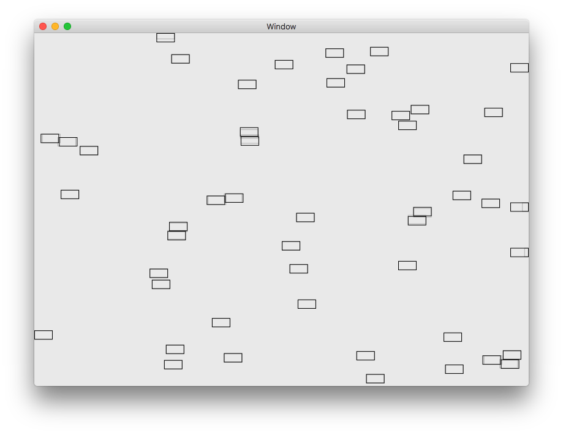
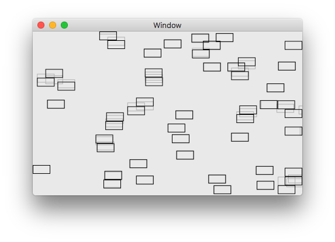

# Label Placement

Implementation of a little algorithm to draw labels/rectangles on a background while trying to avoid overlapping. This is useful for maps, drawing labels on graphs, etc.

In the screenshots you can see the planned area in light grey, while the repositioned ones are in black. The size of the rectangles is arbitrary.

The implementation is specifically simple and not optimized for performance at all. The goal is to be able to understand it.

